# Retainly Database ER Diagram

## Entity Relationship Diagram

```mermaid
erDiagram
    %% ============================================================================
    %% CORE ENTITIES
    %% ============================================================================
    
    ORGANIZATIONS ||--o{ USER_MEMBERSHIPS : "has"
    ORGANIZATIONS ||--o{ COURSES : "owns"
    ORGANIZATIONS ||--o{ STUDENTS : "owns"
    ORGANIZATIONS ||--o{ COURSE_ENROLLMENTS : "owns"
    ORGANIZATIONS ||--o{ ACTIVITY_EVENTS : "owns"
    ORGANIZATIONS ||--o{ RISK_SCORES : "owns"
    ORGANIZATIONS ||--o{ RETENTION_CAMPAIGNS : "owns"
    ORGANIZATIONS ||--o{ MESSAGE_ACTIONS : "owns"
    ORGANIZATIONS ||--o{ AUTOMATION_RULES : "owns"
    ORGANIZATIONS ||--o{ INTEGRATION_CONNECTIONS : "owns"
    ORGANIZATIONS ||--|| SUBSCRIPTIONS : "has"
    ORGANIZATIONS ||--o{ USAGE_TRACKING : "tracks"
    ORGANIZATIONS ||--o{ AUDIT_LOGS : "logs"
    ORGANIZATIONS ||--o{ NOTIFICATIONS : "sends"
    ORGANIZATIONS ||--o{ RETENTION_OUTCOMES : "measures"
    
    USERS ||--o{ USER_MEMBERSHIPS : "member_of"
    USERS ||--o{ AUTOMATION_RULES : "creates"
    USERS ||--o{ AUDIT_LOGS : "performs"
    USERS ||--o{ NOTIFICATIONS : "receives"
    
    COURSES ||--o{ COURSE_ENROLLMENTS : "has"
    COURSES ||--o{ ACTIVITY_EVENTS : "tracks"
    COURSES ||--o{ RISK_SCORES : "monitors"
    
    STUDENTS ||--o{ COURSE_ENROLLMENTS : "enrolled_in"
    STUDENTS ||--o{ ACTIVITY_EVENTS : "generates"
    STUDENTS ||--o{ RISK_SCORES : "assessed"
    STUDENTS ||--o{ MESSAGE_ACTIONS : "receives"
    STUDENTS ||--o{ RETENTION_OUTCOMES : "tracked"
    
    RETENTION_CAMPAIGNS ||--o{ MESSAGE_ACTIONS : "includes"
    RETENTION_CAMPAIGNS ||--o{ RETENTION_OUTCOMES : "produces"
    
    MESSAGE_ACTIONS ||--o{ RETENTION_OUTCOMES : "impacts"

    %% ============================================================================
    %% ORGANIZATIONS
    %% ============================================================================
    
    ORGANIZATIONS {
        uuid id PK
        string name
        string slug UK
        string logo_url
        string website
        string timezone
        jsonb settings
        timestamp created_at
        timestamp updated_at
    }

    %% ============================================================================
    %% USERS & MEMBERSHIPS
    %% ============================================================================
    
    USERS {
        uuid id PK
        string email UK
        string first_name
        string last_name
        string avatar_url
        boolean email_verified
        timestamp last_login_at
        timestamp created_at
        timestamp updated_at
    }
    
    USER_MEMBERSHIPS {
        uuid id PK
        uuid user_id FK
        uuid organization_id FK
        enum role
        timestamp invited_at
        timestamp joined_at
        timestamp created_at
        timestamp updated_at
    }

    %% ============================================================================
    %% COURSES & STUDENTS
    %% ============================================================================
    
    COURSES {
        uuid id PK
        uuid organization_id FK
        string external_id
        string name
        text description
        enum platform
        string thumbnail_url
        boolean is_active
        jsonb metadata
        timestamp created_at
        timestamp updated_at
    }
    
    STUDENTS {
        uuid id PK
        uuid organization_id FK
        string external_id
        string email
        string first_name
        string last_name
        string avatar_url
        string phone
        string timezone
        jsonb metadata
        timestamp created_at
        timestamp updated_at
    }
    
    COURSE_ENROLLMENTS {
        uuid id PK
        uuid organization_id FK
        uuid student_id FK
        uuid course_id FK
        timestamp enrolled_at
        timestamp completed_at
        float progress
        timestamp last_activity_at
        boolean is_active
        jsonb metadata
        timestamp created_at
        timestamp updated_at
    }

    %% ============================================================================
    %% ACTIVITY & RISK
    %% ============================================================================
    
    ACTIVITY_EVENTS {
        uuid id PK
        uuid organization_id FK
        uuid student_id FK
        uuid course_id FK
        enum event_type
        string event_name
        jsonb metadata
        timestamp occurred_at
        timestamp created_at
    }
    
    RISK_SCORES {
        uuid id PK
        uuid organization_id FK
        uuid student_id FK
        uuid course_id FK
        float score
        enum risk_level
        jsonb reasons
        float confidence
        string model_version
        timestamp calculated_at
        timestamp created_at
    }

    %% ============================================================================
    %% RETENTION & CAMPAIGNS
    %% ============================================================================
    
    RETENTION_CAMPAIGNS {
        uuid id PK
        uuid organization_id FK
        string name
        text description
        enum campaign_type
        enum status
        enum target_risk_level
        jsonb target_conditions
        jsonb content
        timestamp scheduled_at
        timestamp started_at
        timestamp completed_at
        timestamp created_at
        timestamp updated_at
    }
    
    MESSAGE_ACTIONS {
        uuid id PK
        uuid organization_id FK
        uuid campaign_id FK
        uuid student_id FK
        enum action_type
        enum status
        jsonb content
        timestamp scheduled_at
        timestamp sent_at
        timestamp delivered_at
        timestamp failed_at
        text error_message
        jsonb metadata
        timestamp created_at
        timestamp updated_at
    }

    %% ============================================================================
    %% AUTOMATION
    %% ============================================================================
    
    AUTOMATION_RULES {
        uuid id PK
        uuid organization_id FK
        string name
        text description
        enum trigger_type
        jsonb conditions
        jsonb actions
        enum status
        int priority
        uuid created_by FK
        timestamp last_triggered_at
        int trigger_count
        timestamp created_at
        timestamp updated_at
    }

    %% ============================================================================
    %% INTEGRATIONS
    %% ============================================================================
    
    INTEGRATION_CONNECTIONS {
        uuid id PK
        uuid organization_id FK
        enum provider
        string name
        enum status
        jsonb config
        timestamp last_synced_at
        text last_error
        int sync_frequency
        jsonb metadata
        timestamp created_at
        timestamp updated_at
    }

    %% ============================================================================
    %% BILLING
    %% ============================================================================
    
    SUBSCRIPTIONS {
        uuid id PK
        uuid organization_id FK
        enum plan
        enum status
        string stripe_customer_id
        string stripe_subscription_id
        timestamp current_period_start
        timestamp current_period_end
        boolean cancel_at_period_end
        timestamp canceled_at
        timestamp trial_ends_at
        jsonb metadata
        timestamp created_at
        timestamp updated_at
    }
    
    USAGE_TRACKING {
        uuid id PK
        uuid organization_id FK
        string metric_name
        int metric_value
        timestamp period_start
        timestamp period_end
        jsonb metadata
        timestamp created_at
    }

    %% ============================================================================
    %% AUDIT & NOTIFICATIONS
    %% ============================================================================
    
    AUDIT_LOGS {
        uuid id PK
        uuid organization_id FK
        uuid user_id FK
        string action
        string entity_type
        uuid entity_id
        jsonb changes
        jsonb metadata
        string ip_address
        text user_agent
        timestamp created_at
    }
    
    NOTIFICATIONS {
        uuid id PK
        uuid organization_id FK
        uuid user_id FK
        enum type
        enum status
        string title
        text message
        string action_url
        jsonb metadata
        timestamp read_at
        timestamp created_at
    }

    %% ============================================================================
    %% RETENTION OUTCOMES
    %% ============================================================================
    
    RETENTION_OUTCOMES {
        uuid id PK
        uuid organization_id FK
        uuid student_id FK
        uuid campaign_id FK
        uuid action_id FK
        float risk_score_before
        float risk_score_after
        decimal revenue_before
        decimal revenue_after
        boolean retained
        boolean churned
        jsonb metadata
        timestamp measured_at
        timestamp created_at
    }
```

## Key Relationships

### Multi-Tenancy (Organization-Centric)
- **Organizations** are the top-level tenant
- All user data is scoped to an organization via `organization_id`
- Row Level Security (RLS) enforces tenant isolation at the database level

### User Management
- **Users** can belong to multiple **Organizations** via **User Memberships**
- Each membership has a specific role: OWNER, ADMIN, COACH, or VIEWER

### Course Structure
- **Organizations** own multiple **Courses**
- **Students** enroll in **Courses** via **Course Enrollments**
- Enrollments track progress, last activity, and completion status

### Activity Tracking
- **Activity Events** capture all student interactions
- Events are linked to students, courses, and organizations
- Used as input for AI risk scoring

### Risk Assessment
- **Risk Scores** are AI-generated churn predictions (0-100)
- Historical scores are preserved (never deleted)
- Includes confidence level, model version, and AI-generated reasons

### Retention System
- **Retention Campaigns** target at-risk students
- **Message Actions** are individual retention interventions (email, SMS, tasks, etc.)
- **Retention Outcomes** measure campaign effectiveness (feedback loop for ML)

### Automation
- **Automation Rules** define trigger-condition-action workflows
- Triggers: risk score changes, activity patterns, milestones, schedules
- Actions stored as JSONB for flexibility

### Integrations
- **Integration Connections** link to external platforms (Kajabi, Teachable, Stripe, etc.)
- Config uses references to encrypted credentials (not plaintext)
- Tracks sync status and errors

### Billing & Usage
- **Subscriptions** manage org-level billing via Stripe
- **Usage Tracking** monitors consumption for billing/analytics

### Audit & Compliance
- **Audit Logs** track all user actions for compliance
- **Notifications** keep users informed of important events

## Database Indexes

### High-Performance Queries
The schema includes strategic indexes for:

1. **Multi-tenant queries**: `organization_id` on all scoped tables
2. **Student lookups**: `student_id`, `email`, `external_id`
3. **Course queries**: `course_id`, `platform`, `is_active`
4. **Time-series queries**: `occurred_at`, `calculated_at`, `measured_at`
5. **Risk analysis**: `risk_level`, `score`, `calculated_at`
6. **Campaign management**: `status`, `scheduled_at`
7. **Integration sync**: `provider`, `status`, `last_synced_at`

## Data Isolation & Security

### Row Level Security (RLS)
PostgreSQL RLS policies ensure:
- Queries automatically filter by `current_setting('app.current_organization_id')`
- Organization A cannot access Organization B's data at the database level
- Even with SQL injection, cross-tenant access is impossible

### Sensitive Data Protection
- **No plaintext passwords** (authentication handled externally)
- **No plaintext API keys** (config JSONB uses vault references)
- **No plaintext Stripe secrets** (references only)

## Scalability Considerations

### Partitioning Candidates (Future)
For high-volume tables, consider partitioning by:
- **activity_events**: Partition by `occurred_at` (monthly/quarterly)
- **risk_scores**: Partition by `calculated_at` (monthly)
- **audit_logs**: Partition by `created_at` (monthly)

### Archive Strategy
- **activity_events**: Archive after 2 years to cold storage
- **audit_logs**: Archive after 7 years (compliance)
- **risk_scores**: NEVER delete (ML training data)

## JSONB Fields

### Flexible Schema Storage
JSONB fields provide flexibility for:

1. **metadata**: Platform-specific custom fields
2. **settings**: Org-level configuration
3. **reasons**: AI-generated risk factors
4. **conditions**: Complex automation logic
5. **actions**: Flexible action definitions
6. **config**: Integration-specific settings
7. **changes**: Audit trail details

## Enums

All enums are defined at the database level for:
- Type safety
- Query optimization
- Data validation
- Application consistency

Key enums:
- UserRole, RiskLevel, ActivityEventType
- RetentionActionType, RetentionCampaignType
- IntegrationProvider, IntegrationStatus
- SubscriptionPlan, SubscriptionStatus
- AutomationStatus, AutomationTriggerType
